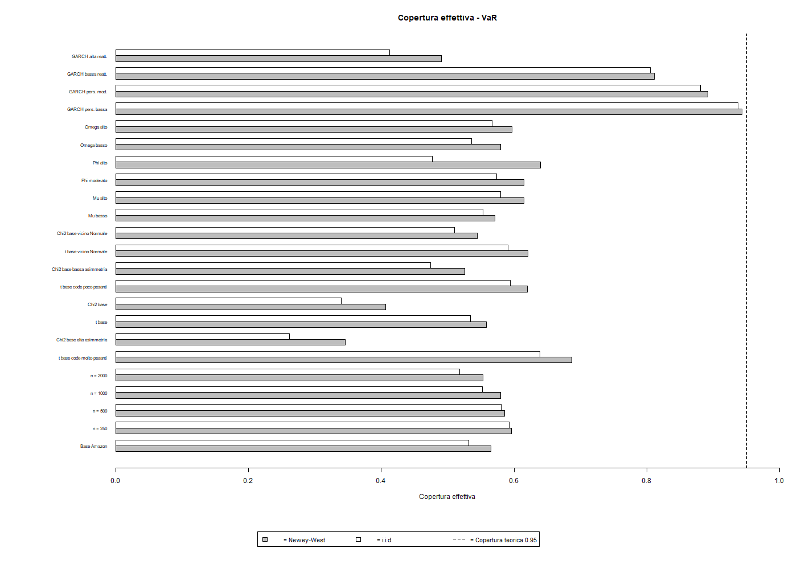
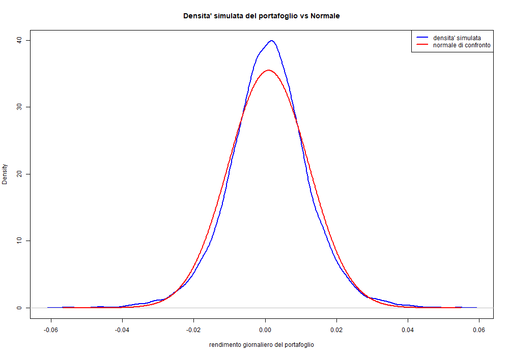
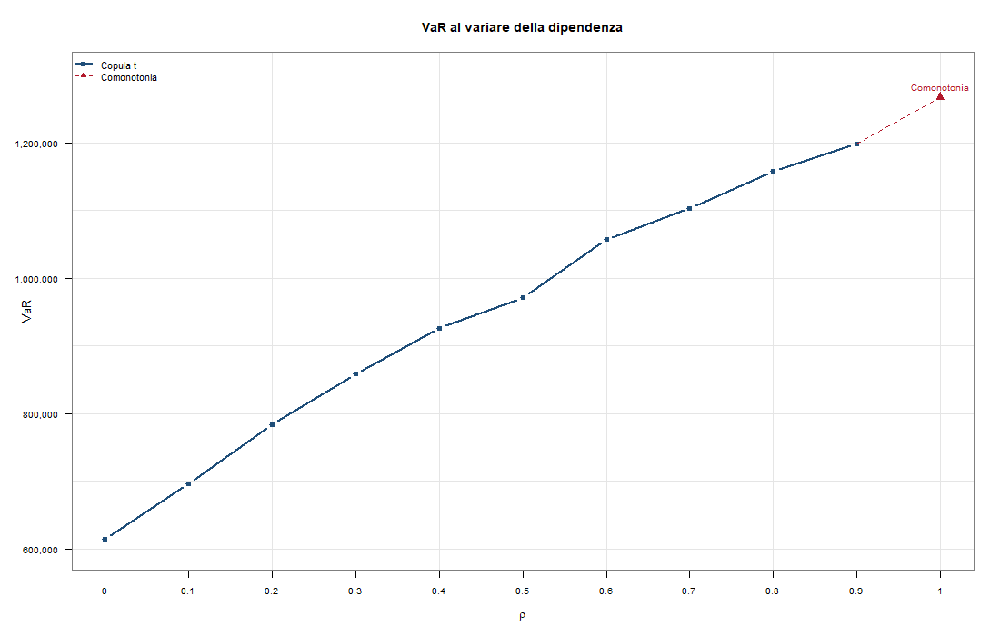

# Financial Market Risk Modelling

University coursework in **financial-market statistics and risk modelling**, covering HAC inference under serial dependence, AR(1)-GARCH(1,1) Monte Carlo experiments, multivariate modelling with Variance-Gamma marginals and a Gaussian copula, and portfolio credit risk under a Student-t dependence structure.

The repository consolidates two coursework projects into one research-style codebase. The emphasis is on statistical inference, dependence modelling and tail-risk measurement rather than on trading signals.

## Authorship

This repository is based on university group coursework completed by a **four-person team**, including me. The public version preserves the analytical scope of the original coursework while reorganising the code for portfolio presentation, excluding non-redistributable raw data and incorporating a small number of technical corrections identified during a later review.

GitHub's contributor count reflects the publication history of this repository and should **not** be interpreted as sole authorship of the original coursework.

## What is implemented

### 1. HAC inference and Monte Carlo coverage

`R/01_inference_newey_west_ar_garch.R`

- Newey-West long-run variance estimation with Bartlett weights.
- Confidence intervals for expected return, standard deviation and left-tail VaR.
- Empirical analysis of an equity return series.
- AR(1)-GARCH(1,1) simulation with non-Gaussian innovations.
- Comparison between dependence-robust intervals and intervals that incorrectly assume i.i.d. observations.
- Sensitivity analysis across sample size, innovation distribution and process parameters.

The simulation is seeded for reproducibility. The experiment is designed around **coverage probability and interval width**, not point-forecast performance.



### 2. Variance-Gamma marginals and Gaussian copula

`R/02_variance_gamma_gaussian_copula.R`

- Ten-asset return panel.
- Maximum-likelihood estimation of Variance-Gamma marginal distributions.
- Probability-integral-transform mapping to Gaussian scores.
- Estimation of a Gaussian copula dependence matrix.
- Monte Carlo simulation from the fitted joint distribution.
- Equal-weight portfolio construction after converting simulated log-returns back to simple returns.
- Distributional and tail-risk diagnostics for the simulated portfolio.

The `vgFit()` estimation is performed on returns rescaled by 100 for numerical stability; the location, scale and skew parameters are subsequently mapped back to the original return scale before `pvg()` / `qvg()` are used.



### 3. CreditRisk+ with Student-t dependence

`R/03_creditrisk_t_copula.R`

- Twenty credit buckets with Gamma-Poisson / negative-binomial marginal default-count distributions.
- Student-t copula with 3 degrees of freedom and equicorrelation parameter `rho`.
- Monte Carlo aggregate-loss simulation across dependence scenarios.
- VaR and Tail Conditional Expectation (TCE) analysis as dependence increases.
- Explicit comonotonic benchmark.
- Discrete empirical quantiles for the simulated loss distribution.

The main result is structural: stronger dependence materially increases portfolio tail risk, while the comonotonic case provides an upper-dependence benchmark for the simulation design.



## Repository structure

```text
.
├── R/
│   ├── 01_inference_newey_west_ar_garch.R
│   ├── 02_variance_gamma_gaussian_copula.R
│   └── 03_creditrisk_t_copula.R
├── data/
│   └── README.md
├── figures/
│   ├── inference/
│   ├── copula/
│   └── credit-risk/
├── results/              # generated locally; ignored by Git
├── .gitignore
└── README.md
```

## R packages

The scripts use packages including:

- `readxl`
- `fGarch`
- `openxlsx`
- `VarianceGamma`
- `mvtnorm`

Package requirements differ by script; see the `library()` calls at the top of each file.

## Data and reproducibility

Raw market-data files from the original coursework are **not redistributed** in this public repository. See [`data/README.md`](data/README.md) for the expected inputs and the data-availability note.

Run the scripts from the repository root. The inference script expects `data/Price_Amazon.xlsx`; the copula script expects `data/prezzi_chiusura.csv`. Generated tables and figures are written to `results/`, which is intentionally ignored by Git. The selected figures tracked under `figures/` are audited outputs retained for the public presentation of the coursework.

The simulation components are reproducible from code because their random-number generation is explicitly seeded. Empirical market-data results require the corresponding input datasets.

## Methodological notes

- Newey-West Bartlett weights use `1 - j / (m + 1)` when `m` is the maximum included lag.
- VaR in the inference section follows the coursework convention of retaining the sign of the left-tail return quantile.
- The Gaussian copula is used as specified in the coursework; it does not model non-zero asymptotic tail dependence.
- Credit-loss quantiles use the empirical inverse CDF (`quantile(..., type = 1)`) to respect the discrete support of aggregate losses.
- TCE is reported according to the coursework convention as the mean simulated loss conditional on loss being at least the estimated VaR threshold.

## Scope

This is an academic modelling project. It is not presented as an investment strategy, production risk engine or evidence of live trading performance.
